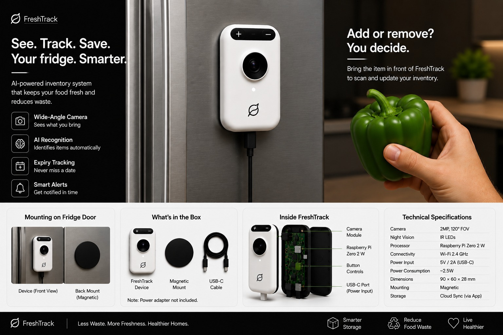

# FreshTrack

<p align="center">
  <strong>AI-powered inventory for your kitchen and home.</strong>
</p>

<p align="center">
  <a href="https://fresh-track.in">
    
  </a>
  
</p>

<p align="center">
  
  
  
</p>

---

## FreshTrack

**FreshTrack keeps track of what you have, what's expiring, and what you can make with it.**

It's an AI-powered household inventory app built around the everyday problem of forgetting what's sitting in your fridge or pantry.

Add groceries using **AI photo recognition, barcode scanning, receipt scanning, or manual entry**. FreshTrack organizes everything into a searchable inventory with quantities, purchase dates, freshness, expiry dates, and more.

Then the AI can actually use that information.

---

## AI Recipes

One of FreshTrack's main features is **AI-powered recipe generation based on your actual inventory**.

Instead of searching for recipes and then checking whether you have the ingredients, FreshTrack starts with what you already own.

You can select ingredients or use your inventory as context and generate recipes around them.

Forgotten vegetables, leftover ingredients, or a random combination of things in your fridge can become an actual meal.

---

## AI Assistant

FreshTrack also lets you interact with your inventory naturally.

Ask questions like:

> What should I cook tonight?

> What expires soon?

> What should I use first?

> What do I need to buy?

> Do I already have onions?

The assistant can use your inventory as context to answer questions and help you decide what to cook, use, or purchase.

---

## Add Anything Easily

### AI Photo Recognition
Point your camera at a product and FreshTrack identifies it — category, storage type, estimated shelf life, and a visual freshness read straight from the photo.

### Barcode Scanner
Scan packaged products for instant lookup. FreshTrack keeps its own self-learning barcode database and falls back to Open Food Facts for anything it hasn't seen yet — so it gets smarter with every scan, by every user.

### Receipt Scanner
Photograph a grocery receipt and FreshTrack reads it with OCR, extracting every purchased item in one pass instead of adding them individually.

### Manual Entry
For fresh produce, homemade food, local-market purchases, or anything else that doesn't have a barcode, items can be added manually — with automatic photo matching where possible.

---

## Freshness & Expiry Tracking

FreshTrack keeps track of when products were purchased and when they should be consumed.

For products without printed expiry dates — especially fruits and vegetables — freshness estimates help determine what should be used first.

You can see:

* purchase date
* expiry date
* freshness
* quantity
* availability
* location

FreshTrack sends real push notifications as products approach expiry — configurable per category, not just an on/off switch.

---

## Inventory

Everything you have is organized into one searchable inventory.

Search for a product and quickly see its current quantity, freshness, expiry, purchase information, and other details.

The dashboard gives you a real analytics layer on top of your household inventory: category and storage breakdowns, monthly waste trends, spending insights, purchase history, and predictions for when you'll run out of something you buy regularly.

---

## Shopping & Consumption

FreshTrack connects what you **buy**, **have**, **use**, and **need**.

Shopping lists help keep track of what you need to purchase, while the analytics layer shows how your household actually uses its inventory over time — what gets wasted, what gets used, and what's worth buying differently.

This makes it easier to avoid:

* buying things you already have
* forgetting products until they expire
* letting fresh produce go unused
* losing track of what's in the fridge

---

## Built for Real Kitchens

FreshTrack works with both packaged groceries and everyday fresh food.

That means you can track things like:

**vegetables · fruits · dairy · packaged food · bakery items · homemade food · local-market produce**

Fresh produce is especially important because it often doesn't have a standardized expiry date. FreshTrack uses purchase information and freshness estimates to help you know what should be consumed first.

---

## A Custom-Trained Freshness Model

Most of FreshTrack's AI features run on general-purpose vision models. For produce freshness specifically, FreshTrack also ships its own model — trained from scratch on a labeled dataset of fresh and rotten fruits and vegetables, then converted to run entirely client-side with TensorFlow.js.

No API call, no round trip — the moment you point your camera at a piece of produce, freshness gets classified locally, on-device.

It's an early feature and it'll keep improving as it sees more data, but it's a real, independently-trained model doing real inference — not just prompting an existing LLM.

---

## What's Next: A Physical FreshTrack Device

The long-term vision for FreshTrack isn't just an app you remember to open — it's a device that watches your fridge for you.

<p align="center">
  
</p>

**See. Track. Save.** A small magnetic camera mounts to the inside of your fridge door. Bring an item in front of it — add or remove, your call — and it scans and updates your inventory automatically. No phone, no manual entry, no forgetting to log what you just used.

| | |
|---|---|
| **Camera** | 2MP, 120° FOV |
| **Night Vision** | IR LEDs |
| **Processor** | Raspberry Pi Zero 2 W |
| **Connectivity** | Wi-Fi 2.4GHz |
| **Power** | 5V / 2A (USB-C), ~2.5W |
| **Dimensions** | 90 × 60 × 28 mm |
| **Mounting** | Magnetic |
| **Storage** | Cloud sync via the FreshTrack app |

This isn't just a concept sitting in a deck — the groundwork is already in the app today. Open the scanner and you'll find a **"Fridge Device"** tab that simulates exactly this flow: intake arriving from a paired camera, writing straight into the same pantry as every other scan method. When the hardware ships, it plugs into infrastructure that already exists.

---

## How It Works

```text
       Add groceries
             │
  ┌────┬─────┼─────┬────────┐
  ▼    ▼     ▼      ▼        ▼
Camera Barcode Receipt  Manual  Fridge
                                Device
  │    │     │      │        │
  └────┴─────┼──────┴────────┘
             ▼
        INVENTORY
             │
     ┌───────┼────────┐
     ▼       ▼        ▼
  Freshness Expiry  Analytics
     │       │        │
     └───────┼────────┘
             ▼
             AI
      ┌──────┼──────┐
      ▼      ▼      ▼
   Recipes Assistant Shopping
```

**Your inventory becomes the context for everything else.**

---

<p align="center">
  <a href="https://fresh-track.in">
    <strong>→ Open FreshTrack</strong>
  </a>
</p>

<p align="center">
  <sub>Know what you have. Know what to cook.</sub>
</p>
